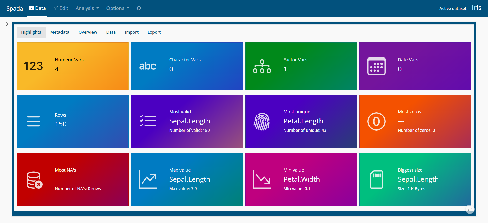

<!-- README.md is generated from README.Rmd. Please edit that file -->

```{r, include = FALSE}
knitr::opts_chunk$set(
  collapse = TRUE,
  comment = "#>",
  fig.path = "man/figures/README-",
  out.width = "100%"
)
```

# spada ([**S**]{.underline}hiny [**Pa**]{.underline}ckage for [**D**]{.underline}ata [**A**]{.underline}nalysis)

<!-- badges: start -->

<!-- badges: end -->

The goal of **spada** is to provide visual tools for Data Analysis in a Shiny App.

## Installation

You can install the development version of spada from [GitHub](https://github.com/) with:

``` r
# install.packages("devtools")
devtools::install_github("lgschuck/spada")
```

## Loading the package

```{r}
library(spada)
```

## Use

```{r}
if(interactive()){
  spada()
}
```

## Screenshots

### Data




### Edit


### Analysis


### Options


