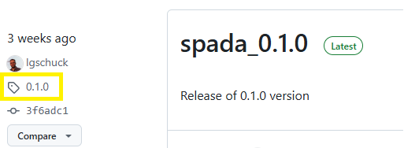

<!-- README.md is generated from README.Rmd. Please edit that file -->

# spada (<u>**S**</u>hiny <u>**Pa**</u>ckage for <u>**D**</u>ata <u>**A**</u>nalysis) 

<!-- badges: start -->
<!-- badges: end -->

The goal of **spada** is to provide visual tools for Data Analysis in a
Shiny App.

This package is inspired in many other tools like:

- IBM SPSS Statistics (<https://www.ibm.com/products/spss-statistics>)

- R Commander package
  (<https://cran.r-project.org/web/packages/Rcmdr/index.html>)

- Jamovi (<https://www.jamovi.org/>)

- ydata profiling (<https://docs.profiling.ydata.ai/latest/>)

<div style="border: 2px solid #02517d; padding: 10px; background-color: #a9ccdb;">

<strong>Warning:</strong> Spada is in active development.

</div>

## Installation

You can install the development version of spada from
[GitHub](https://github.com/) using the command below. This way you will
get the same packages used in the Spada development.

``` r
install.packages("remotes")
remotes::install_github(
  "lgschuck/spada",
  dependencies = TRUE,
  repos = 'https://packagemanager.posit.co/cran/2024-12-10'
  )
```

For a specific release visit
[Releases](https://github.com/lgschuck/spada/releases) and change the
ref parameter bellow for the tag name:



``` r
remotes::install_github(
  "lgschuck/spada",
  dependencies = TRUE,
  repos = 'https://packagemanager.posit.co/cran/2024-12-10',
  ref = "2025.01.13-1"
  )
```

### Loading the package

``` r
library(spada)
```

### Usage

``` r
if(interactive()){
  spada()
}
```

## Docker

Spada is distributed as a **Docker Image**.

For instructions in how to download and use Spada go to [Articles \>
Docker](https://lgschuck.github.io/spada/articles/docker.html)

You can use [Docker Hub](https://hub.docker.com/r/lgschuck/spada) to
search for diferent versions.

## Screenshots


### Data


#### Data \> Metadata


#### Data \> Overview


### Edit


### Analysis


### Output


### Options


