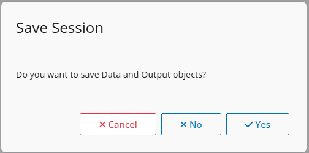

# Config

## Config

Menu Options \> Config

In **Spada** yout can choose some configurations that will persist
trough RDS files saved in the R_user_dir folder. One file for Session
Data and another file for Config.

The options available are:

- **Plot** colors

  - Line: color of the line
  - Fill: fill color of plots

- [**Themes**](https://lgschuck.github.io/spada/articles/themes.html)

  - Spada: default theme
  - Dark Spada: based on Boosttrap Darkly

- **Size** of inputed files

  - choose the size of files to be imported (default 1 GB)

- **Session**

  - Restore data at startup:

    - Always

    - Never (default)

  - Save when exit:

    - Always

    - Ask (default)

    - Never

