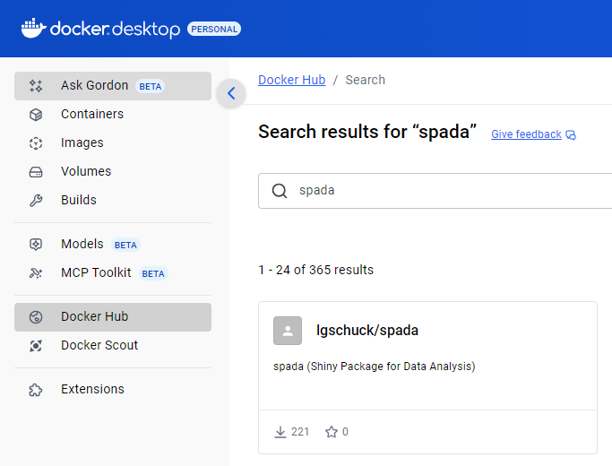
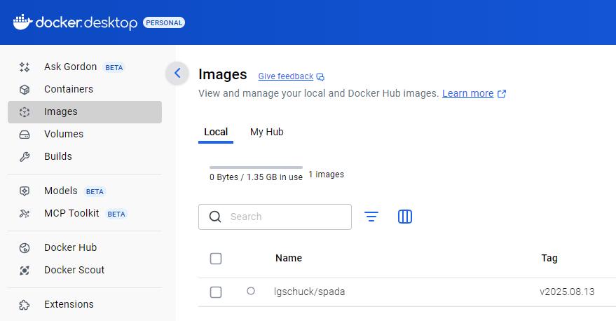
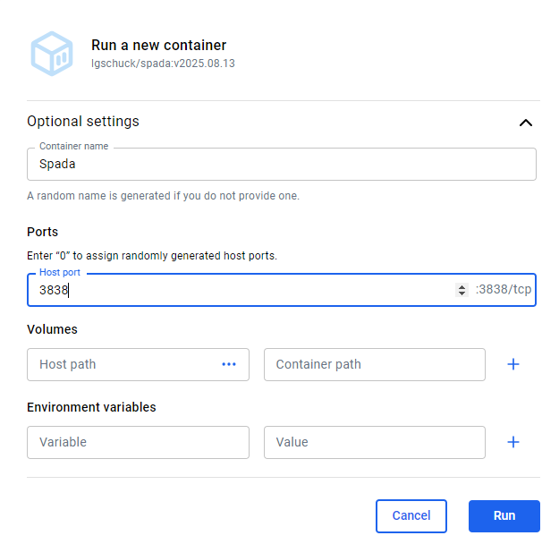
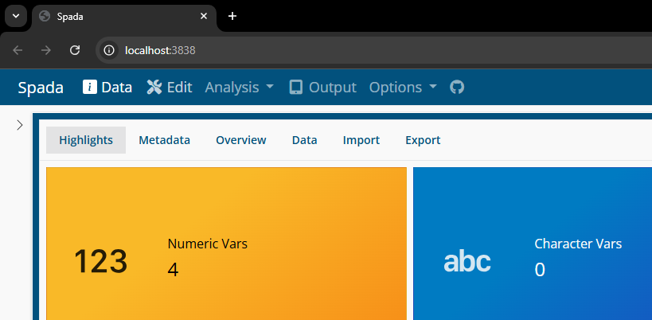
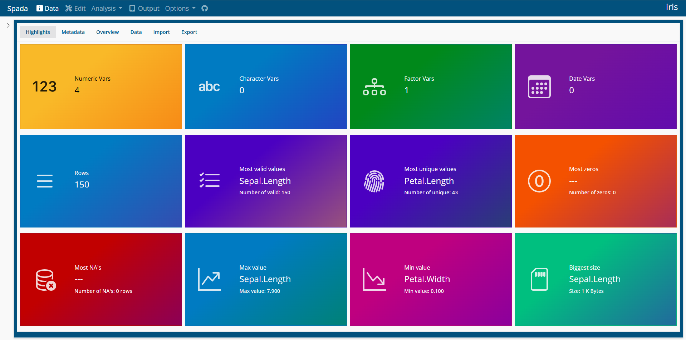

# Docker

### Docker

The best way to run Spada is through Docker. As Spada uses specific
versions of packages and R itself, the Container ensures that you will
have everything you need to run Spada properly.

#### Search Image

In the **Docker Desktop** click in **Docker Hub**.

Search for spada.

#### Pull Image

Find the **tag** you want to download and click **Pull image**. This
will download the image from Docker Hub.

After the download is completed the image will appear in **Images**.

Click in the desired image.

## Run

Click in Run

Open Optional settings.

Insert a Name for the Container and set the **Host Port to 3838**.

Now the Container will be running.

To open it, click in **3838:3838** below the Container name or go in a
browser and use the **localhost:3838** address.

Your web browser will open in localhost:3838.

#### Spada

