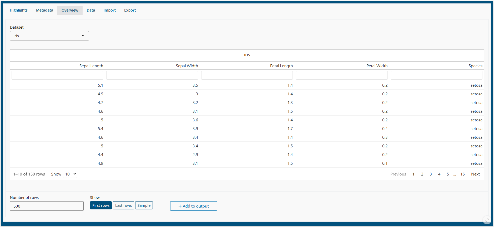
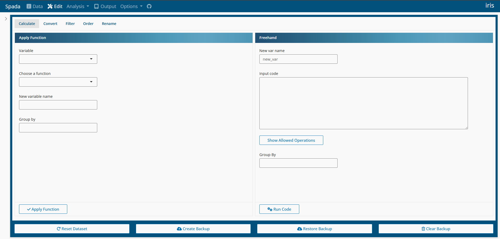
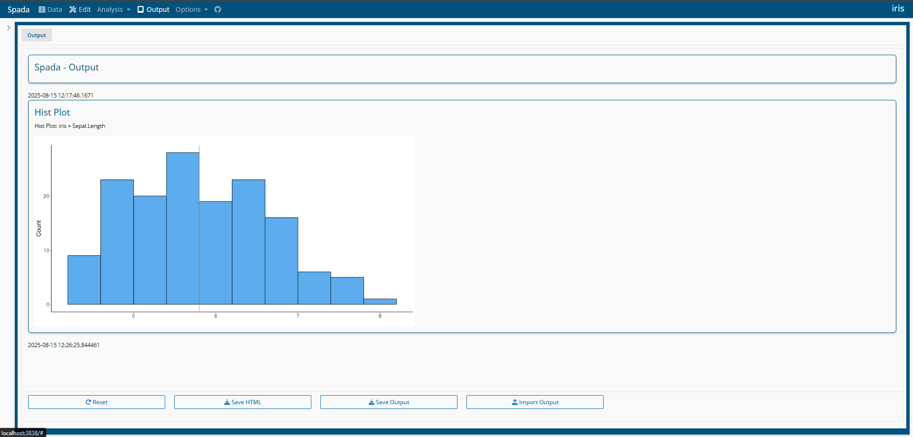

# Intro

## Datasets

The basic object in Spada is a dataset. A dataset is an object of the
data.frame class. Internally, for speed and programmability purposes,
Spada uses the data.table class from the
[**data.table**](https://rdatatable.gitlab.io/data.table/) package.

Spada demands at least one dataset. If none is provided in the funcion
call then Iris and Mtcars, from datasets package, are used as sample
data.

``` r
library(spada)
spada()
```

For multiples datasets as input:

``` r
spada(iris, mtcars, cars)
```

### Dataset Names

If the user desires to give names to datasets, then the Spada function
should be called like this:

``` r
spada('dataset' = iris, 'test_data' = mtcars)
```

Spada will make valid and unique names with **make.names** function. So:

``` r
spada('dataset 1' = iris, 'test data' = mtcars, 'dataset 1' = cars)
```

Will result in names: dataset.1, test.data and dataset.1.1.

If the user inform at least one name, Spada will assume that the
datasets should receive a name (instead the name of the original object)
and **will create valid and unique names** using dataset_n, being n a
sequencial number:

``` r
spada('dataset 1' = iris, mtcars, cars)
```

Will result in names: dataset.1, dataset_2 and dataset_3.

### Active Dataset

The dataset in which the operations will be applied are the **Active
dataset**. One can think of this dataset as the current object. As Spada
requires at least one dataset, won’t be possible to delete the Active
dataset.

## Navbar

Spada uses a page_navbar from bslib package. In the left side are the
menus that lead to the app pages. In the right side are the **Active
dataset** name.


## Navbar Menus

### Data

This is the default selected item.

#### Highlights


#### Metadata


#### Overview



#### Data


#### Import


#### Export


### Edit



### Analysis


### Output



### Config


