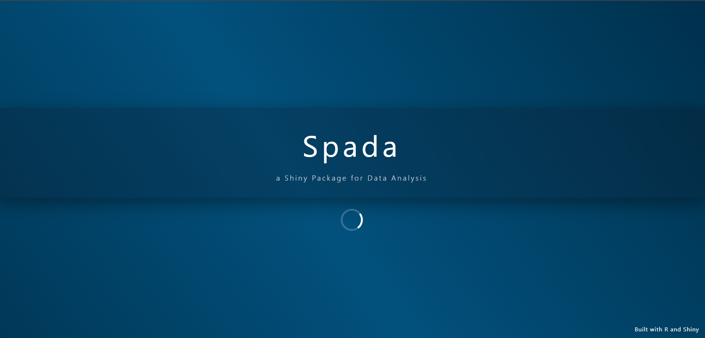
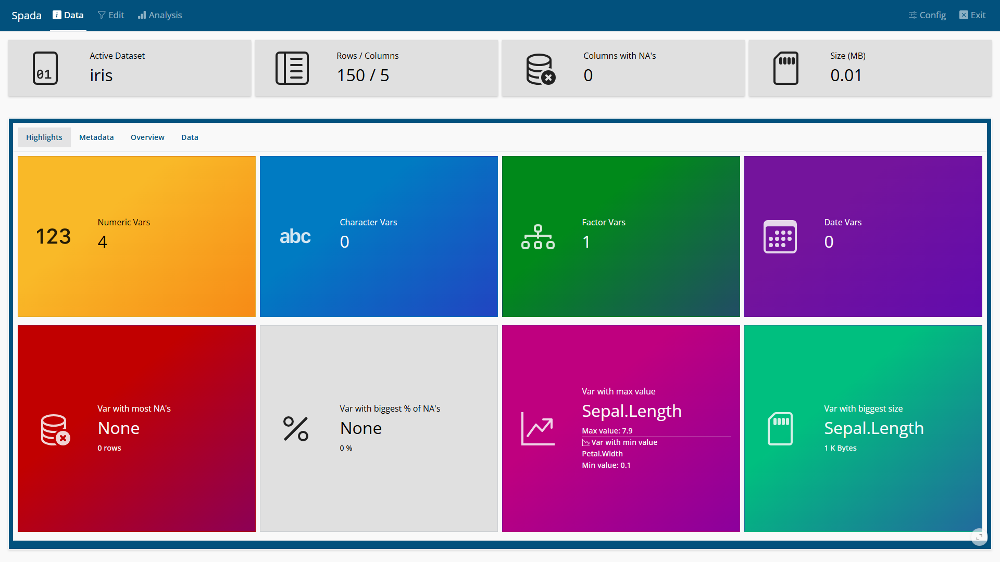
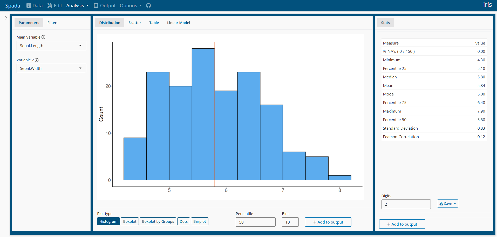

# spada (***S***hiny ***Pa***ckage for ***D***ata ***A***nalysis)

**Spada** provides a ‘shiny’ application with a user-friendly interface
for interactive data analysis. It supports exploratory data analysis
through descriptive statistics, data visualization, statistical tests
(e.g., normality assessment), linear modeling, data import,
transformation and reporting.

This package is inspired in many other tools like:

- IBM SPSS Statistics (<https://www.ibm.com/products/spss-statistics>)

- R Commander package (<https://CRAN.R-project.org/package=Rcmdr>)

- Jamovi (<https://www.jamovi.org/>)

- ydata profiling (<https://docs.profiling.ydata.ai/latest/>)

**Warning:** Spada is in active development.

## [Live Demo](https://lgschuck.shinyapps.io/spada)

You may try Spada in shinyapps.io
[Spada](https://lgschuck.shinyapps.io/spada)

## Documentation

You can access Spada Book on this website: [Spada
Book](https://lgschuck.github.io/spada_book/).

## Installation

``` r

install.packages("spada")
```

You can install the development version of spada from
[GitHub](https://github.com/) using the command below.

``` r

install.packages("remotes")
remotes::install_github(
  "lgschuck/spada",
  dependencies = TRUE
)
```

### Loading the package

``` r

library(spada)
```

### Usage

``` r

if(interactive()){
  spada()
}
```

## Docker

Spada is distributed as a **Docker Image**.

For instructions in how to download and use Spada go to
[Docker](https://lgschuck.github.io/spada_book/docker.html)

You can use [Docker Hub](https://hub.docker.com/r/lgschuck/spada) to
search for diferent versions.

## Screenshots



Loading

### Data



Home


Home 2

#### Data \> Metadata


Metadata

#### Data \> Overview


Overview

### Edit


Edit

### Analysis



Analysis

### Output


Output

### Options


Options
