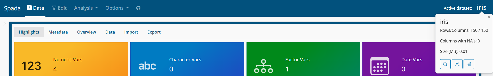

```{r, include = FALSE}
knitr::opts_chunk$set(
  collapse = TRUE,
  comment = "#>"
)
```

## Datasets

The basic object in Spada is a dataset. A dataset is an object of the data.frame class. Internally, for speed and programmability purposes, Spada uses the data.table class from the data.table package.

So Spada demands at least one dataset. If none is provided in the funcion call the Iris and Mtcars, from datasets package, are used.

```{r, eval = FALSE}
library(spada)
spada()
```

For multiples datasets:

```{r, eval = FALSE}
spada(df1, df2, df3)
```

### Active Dataset

The dataset in which the operations will be applied are the Active dataset. One can think of this dataset as the current object. As Spada requires at least one dataset, won't be possible to delete the Active dataset.

## Navbar

Spada uses a page_navbar from bslib package. In the left side are the menus that lead to the app pages. In the right side are the Active dataset name.


