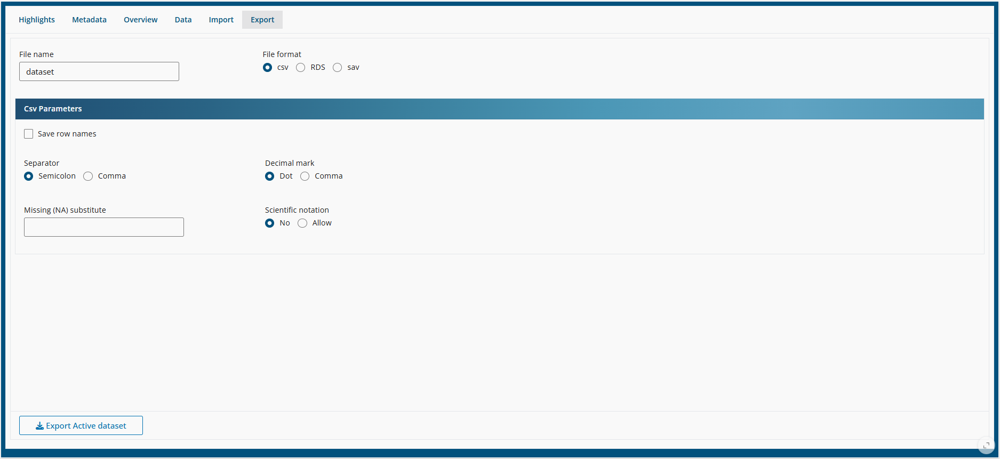

```{r, include = FALSE}
knitr::opts_chunk$set(
  collapse = TRUE,
  comment = "#>"
)
```

## Data

**Spada** is capable of manage several datasets. The Active Dataset is shown in the sidebar and the navbar.But you can change the active dataset, import new datasets and export datasets.

### Highligths


This tab shows some descriptive data about the Acctive Dataset.

### Metadata


In Metadata one can see tyhe type and class of the variables, as well as some informatios about the data: min and max values, unique, valid, zeros and missing data.

It is possible to choose the datasets among the imported ones to show ta metadata. This does no change the Active Dataset.

### Overview


The Overview allows the user to see some sample of Data. It is possible to choose the number of rows to show, as well as the position of the data (if first, last or a random sample of rows).

### Data


In this tab one can change do:

- Rename a dataset
- Change the Active Dataset
- Copy a dataset
- Delete a dataset

As Spada requires at least one active dataset, it is no tpossible to delete the Active one.


### Import 


Here it is possible to import datasets from outside of the Spada package.

The formats available are:

- csv: imported via data.table package
- RDS: R native format
- sav: SPSS format imported via haven package

### Export



It is also possible to save the atsets to a file. 

The formats available are:

- csv: exported via data.table package
- RDS: R native format
- sav: SPSS format exported via haven package
