```{r, include = FALSE}
knitr::opts_chunk$set(
  collapse = TRUE,
  comment = "#>"
)
```

## Docker

The best way to run Spada is through Docker. As Spada uses specific versions of packages and R itself,  the Container ensures that you will have everything you need to run Spada properly.

### Search Image

In the **Docker Desktop** click in **Docker Hub**.

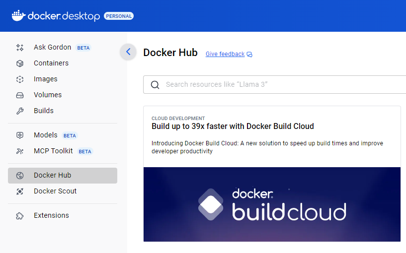

Search for spada.

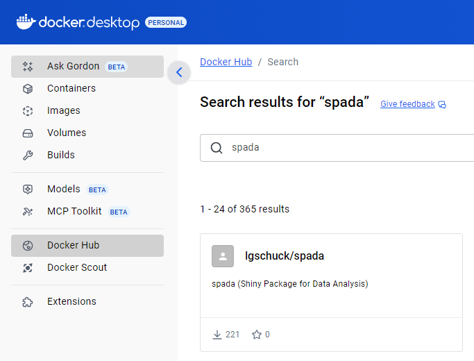

### Pull Image

Find the **tag** you want to download and click **Pull image**. This will download the image from Docker Hub.

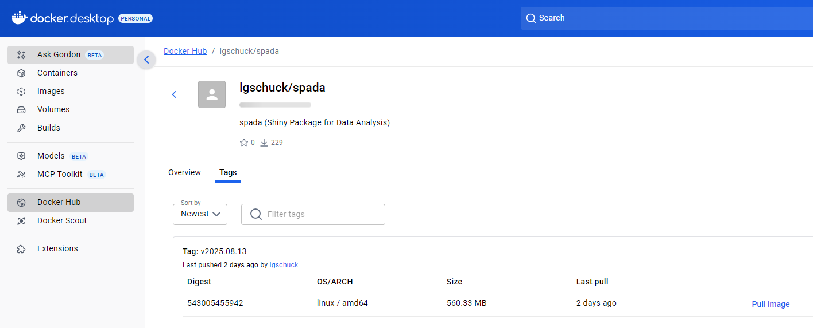

After the download is completed the image will appear in **Images**.

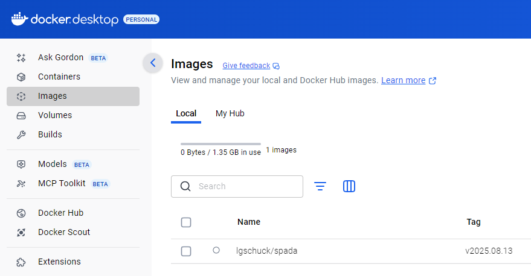

Click in the desired image.

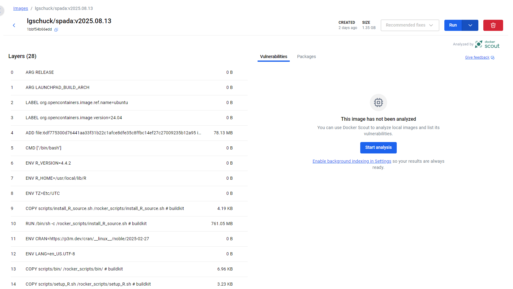

# Run 

Click in Run

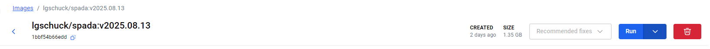

Open Optional settings.

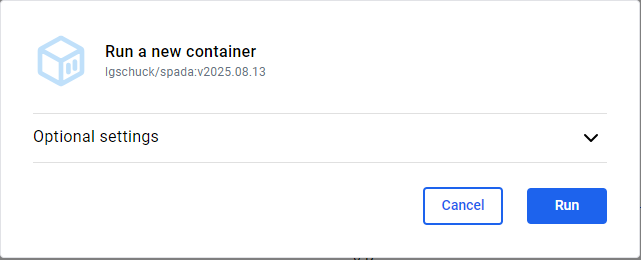

Insert a Name for the Container and set the **Host Port to 3838**.

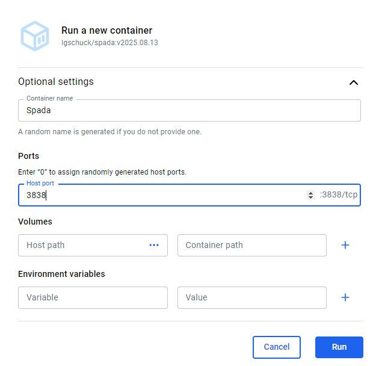

Now the Container will be running. 

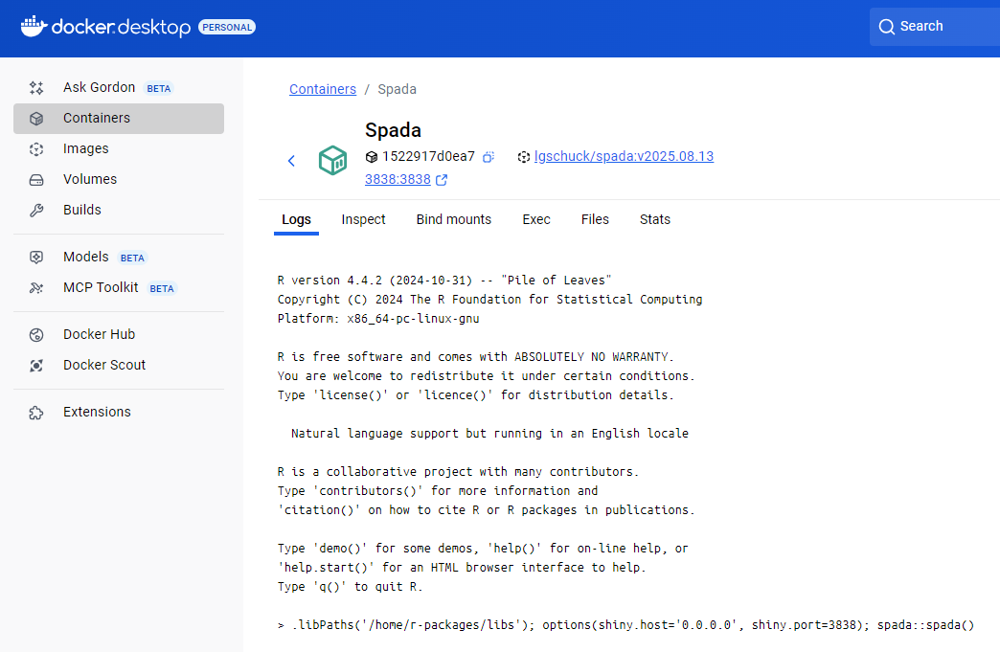

To open it, click in **3838:3838** below the Container name or go in a browser and use the **localhost:3838** address.

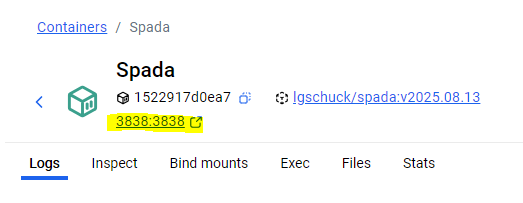

Your web browser will open in localhost:3838.

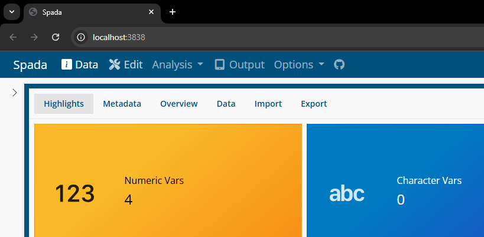

### Spada 

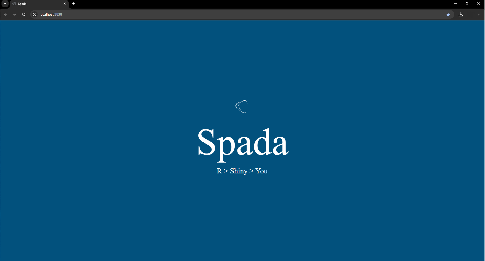

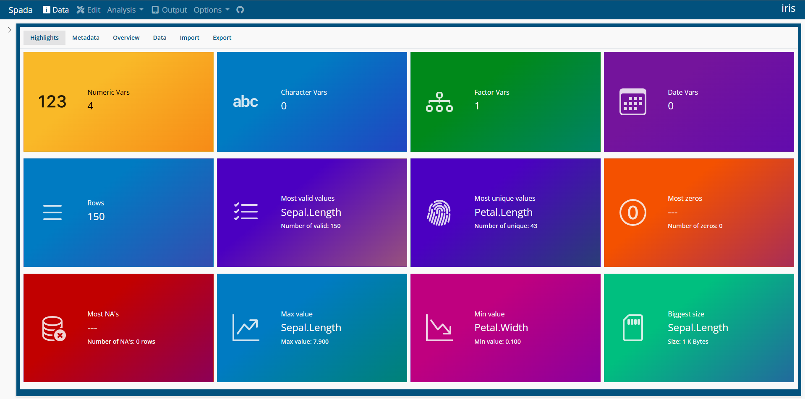


