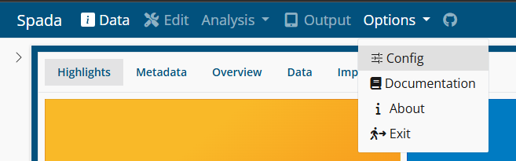
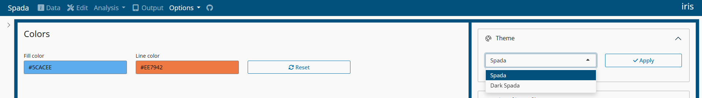
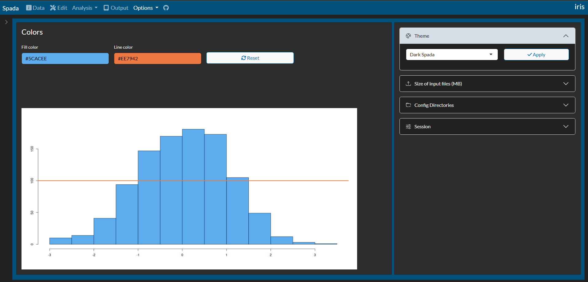

```{r, include = FALSE}
knitr::opts_chunk$set(
  collapse = TRUE,
  comment = "#>"
)
```

## Themes

**Spada** has 2 themes:

- Spada

- Dark Spada

### Choosing the Theme

Menu Options > Config



Open **Theme**



Choose the desired Theme and **Apply**. The app will be updated to the choosed theme.


